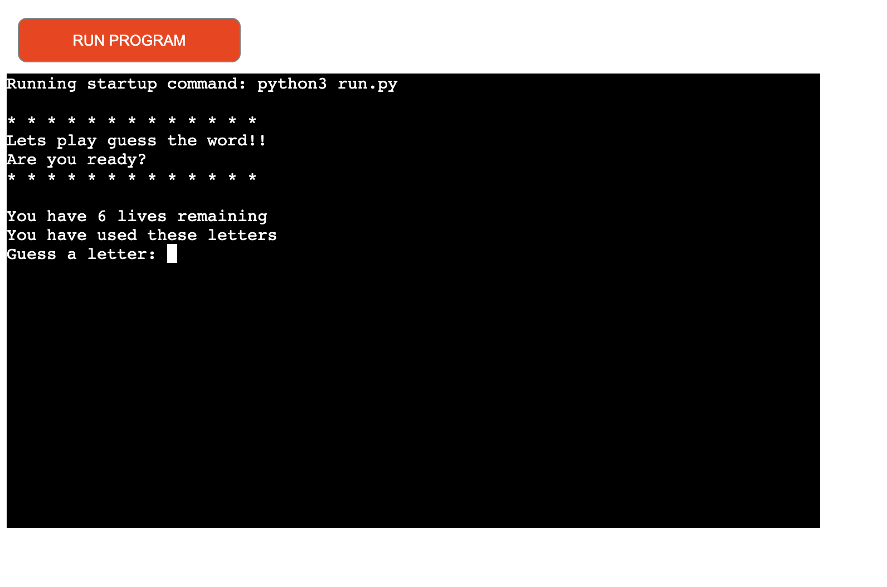

# Guess the Word

Guess the word is a python terminal game that runs as a mock terminal app provided by Code Institute deployed on Heroku.

The game is based on the classic Hangman game, however instead of a image of a hangman every time you lose a life it just shows how many lives you have remaining.

## How to play

Guess the word is a pretty simple game. It starts off by welcoming the player and asks if they are ready to play.

It will also show  the player how many lives remaining, so they understands how many guesses they have to beat the game.

The game starts of by showing the random word as spaced out underscores for the letters. This shows the player how long the word is.

The player then has the option of guessing a letter each time by typing a letter into the terminal and hitting the enter key.

The game ends either if the player guesses the word and beats the game or the player runs out of lives.

The player then has the option of playing again.

## Features

* The random word is generated after the player has guessed their first letter. If the player is correct the letter will show with in the underscores. As you can see in the first image. 

The second image shows the word blank as underscores because the player has not found a correct letter.

* The game tracks what the player has guessed and also how many lives they have remaining. The lives decrease after an incorrect guess and the terminal also shows what letters the player has used.

* Input validation comes with a few messages depending on what the player has been inputted.

    * The first image shows that the player has input the incorrect letter

    * The second image shows that the player put a number instead of a letter and shows a message of invalid input.

    
    * The next image shows the validation that the player has won the game.

    * The last image shows validation that the player has unfortunately lost the game.

* The last feature allows the player to play again feature, allows user to have the option of playing again. Depending on what the player would like to choose.

## Data Model

## Testing

I have passed the code through a [PEP8 validator](http://pep8online.com/) and there are no problems.

I have done numerous tests on the code within local terminal of GitHub. 

## Deployment

This project was deployed using the Code Institutes mock terminal within Heroku.

* Deployment of  the Heroku App steps:
    * Used a cloned template for the repository from Code Institute
    * Created a new Heroku app by setting up a free account, making sure that when you set up your account that you select the correct region of where you are.
    * Once you have set up your account you are then ready to creat your app. Find the create new app button and click to move forward. Create the name of the app and remember to select the right region of where you live.
    * Once on the newly created app, find the deploy tab and link your reposiory profile, in this case using GitHub. 
    * Once your repository is linked and you have found the code you want to use. You can either manualy deploy every time you push your code to your repository you have to come back to heroku to redeploy the app or you can automatically update so that everytime you push your code, it also updates the heroku app aswell.
    * Once you have done those steps you are ready to use your new app.